# hyperclaude Architecture

Comprehensive architecture documentation with detailed diagrams for the hyperclaude swarm orchestration system.

## Table of Contents

1. [System Overview](#system-overview)
2. [Component Architecture](#component-architecture)
3. [Directory Structure](#directory-structure)
4. [Startup Sequence](#startup-sequence)
5. [Task Execution Flow](#task-execution-flow)
6. [Protocol System](#protocol-system)
7. [State Management](#state-management)
8. [Trigger System](#trigger-system)
9. [Protocol Workflows](#protocol-workflows)
   - [Default Protocol](#default-protocol-workflow)
   - [Git-Branch Protocol](#git-branch-protocol-workflow)
   - [Search Protocol](#search-protocol-workflow)
   - [Review Protocol](#review-protocol-workflow)
10. [Token Efficiency](#token-efficiency)
11. [Data Flow](#data-flow)
12. [Security Model](#security-model)

---

## System Overview

The hyperclaude system creates a coordinated swarm of Claude Code instances within a tmux session.

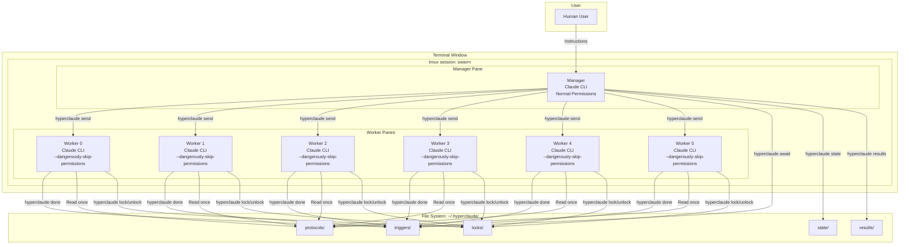

---

## Component Architecture

```mermaid
graph TB
    subgraph "CLI Layer (cli.py)"
        CLI_MAIN[main<br/>Start swarm]
        CLI_STOP[stop<br/>Stop swarm]
        CLI_PROTO[protocol<br/>Set/get protocol]
        CLI_PHASE[phase<br/>Set/get phase]
        CLI_SEND[send<br/>Send to worker]
        CLI_BCAST[broadcast<br/>Send to all]
        CLI_AWAIT[await<br/>Wait for trigger]
        CLI_STATE[state<br/>View states]
        CLI_DONE[done<br/>Signal complete]
        CLI_LOCK[lock/unlock<br/>File locks]
    end

    subgraph "Launcher Layer (launcher.py)"
        L_START[start_swarm<br/>Create tmux session]
        L_STOP[stop_swarm<br/>Kill session]
        L_SEND[send_to_worker<br/>tmux send-keys]
        L_STATUS[get_swarm_status<br/>Token counts]
        L_CLEAR[clear_all_workers<br/>Send /clear]
        L_PREAMBLE[get_manager_preamble<br/>Manager init text]
    end

    subgraph "Protocol Layer (protocols.py)"
        P_LIST[list_protocols<br/>Available protocols]
        P_GET[get_protocol<br/>Read protocol file]
        P_SET[set_active_protocol<br/>Write state/protocol]
        P_PHASE[get/set_phase<br/>Phase management]
        P_STATE[get/set_worker_state<br/>JSON state]
        P_TRIG[create/await_trigger<br/>Trigger files]
        P_INSTALL[install_default_protocols<br/>Copy templates]
    end

    subgraph "Config Layer (config.py)"
        C_DIRS[ensure_directories<br/>Create ~/.hyperclaude/]
        C_LOAD[load_config<br/>Read config.yaml]
        C_PATHS[get_*_dir/file<br/>Path helpers]
    end

    subgraph "tmux"
        TMUX[tmux commands<br/>send-keys, capture-pane]
    end

    subgraph "File System"
        FS[~/.hyperclaude/*]
    end

    CLI_MAIN --> L_START
    CLI_STOP --> L_STOP
    CLI_SEND --> L_SEND
    CLI_SEND --> P_STATE
    CLI_PROTO --> P_SET
    CLI_PHASE --> P_PHASE
    CLI_AWAIT --> P_TRIG
    CLI_STATE --> P_STATE
    CLI_DONE --> P_TRIG
    CLI_DONE --> P_STATE

    L_START --> C_DIRS
    L_START --> P_INSTALL
    L_START --> TMUX
    L_SEND --> TMUX

    P_STATE --> FS
    P_TRIG --> FS
    P_GET --> FS
    C_DIRS --> FS
```

---

## Directory Structure

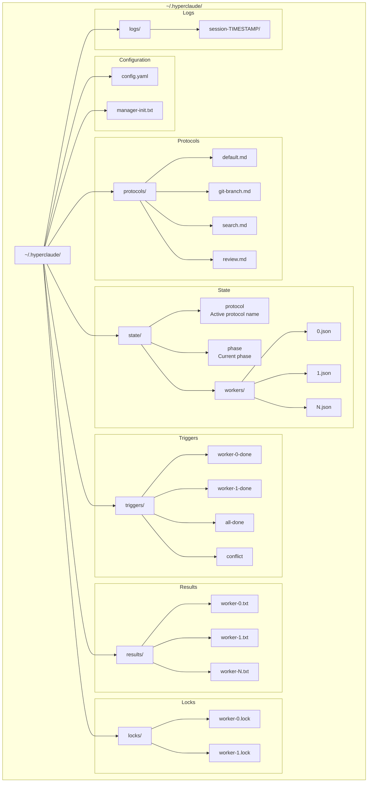

---

## Startup Sequence

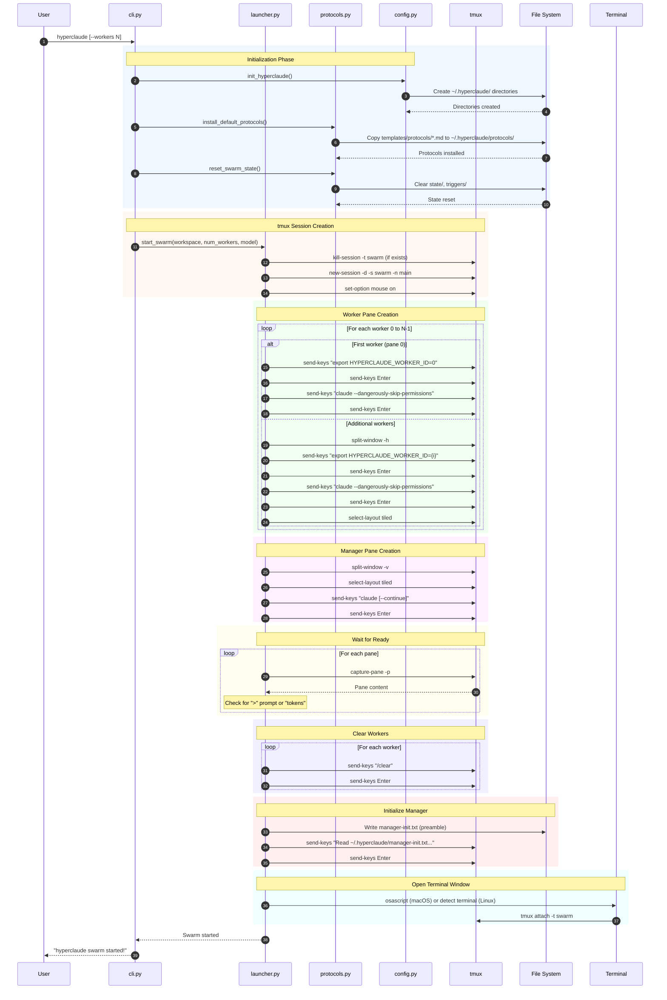

---

## Task Execution Flow

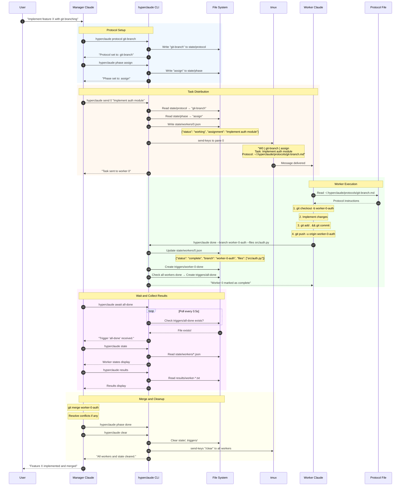

---

## Protocol System

### Protocol Loading Flow

```mermaid
flowchart TD
    subgraph "Protocol Installation"
        A[hyperclaude start] --> B{protocols/ exists?}
        B -->|No| C[Copy templates/protocols/*.md<br/>to ~/.hyperclaude/protocols/]
        B -->|Yes| D[Skip installation]
        C --> D
    end

    subgraph "Protocol Selection"
        E[hyperclaude protocol git-branch] --> F{Protocol file exists?}
        F -->|Yes| G[Write 'git-branch' to state/protocol]
        F -->|No| H[Error: Protocol not found]
        G --> I[Protocol active]
    end

    subgraph "Protocol Usage"
        J[hyperclaude send 0 'task'] --> K[Read state/protocol]
        K --> L[Get protocol name]
        L --> M[Build minimal preamble]
        M --> N["W0 | {protocol} | {phase}<br/>Task: {task}<br/>Protocol: {path}"]
        N --> O[Send to worker via tmux]
    end

    subgraph "Worker Protocol Reading"
        P[Worker receives task] --> Q[Parse protocol path from preamble]
        Q --> R[Read ~/.hyperclaude/protocols/{name}.md]
        R --> S[Cache protocol instructions]
        S --> T[Execute according to protocol]
    end
```

### Protocol File Structure

```mermaid
graph TD
    subgraph "Protocol File Structure"
        TITLE["# Protocol Name"]

        subgraph "Overview Section"
            OVERVIEW[Description of workflow]
        end

        subgraph "Phases Section"
            PHASES["## Phases"]
            P1["- **phase1** - Description"]
            P2["- **phase2** - Description"]
            P3["- **phaseN** - Description"]
        end

        subgraph "Worker Actions Section"
            WORKER["## Worker Actions"]
            W_TASK["### On Task Receipt"]
            W_STEPS["1. Step 1<br/>2. Step 2<br/>3. hyperclaude done"]
            W_ERROR["### On Error"]
            W_ERR_STEPS["hyperclaude done --error 'msg'"]
        end

        subgraph "Manager Actions Section"
            MANAGER["## Manager Actions"]
            M_SETUP["### Setup"]
            M_SEND["### Send Tasks"]
            M_WAIT["### Wait and Process"]
        end

        subgraph "State Format Section"
            STATE["## State Format"]
            STATE_FIELDS["Worker state includes:<br/>- status<br/>- branch<br/>- files<br/>- error"]
        end
    end

    TITLE --> OVERVIEW
    OVERVIEW --> PHASES
    PHASES --> P1 --> P2 --> P3
    P3 --> WORKER
    WORKER --> W_TASK --> W_STEPS
    W_STEPS --> W_ERROR --> W_ERR_STEPS
    W_ERR_STEPS --> MANAGER
    MANAGER --> M_SETUP --> M_SEND --> M_WAIT
    M_WAIT --> STATE --> STATE_FIELDS
```

---

## State Management

### Worker State Lifecycle

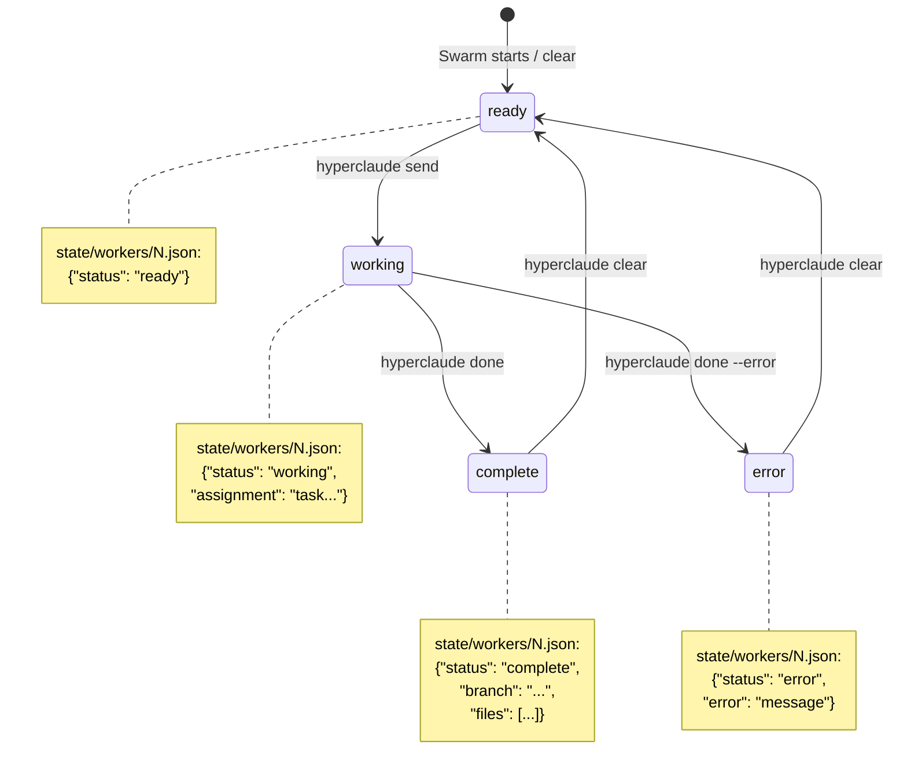

### State File Interactions

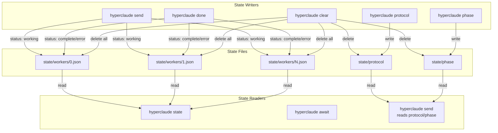

---

## Trigger System

### Trigger Flow

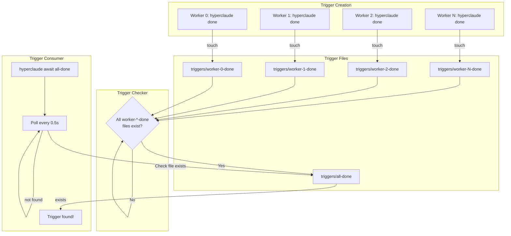

### Trigger Types

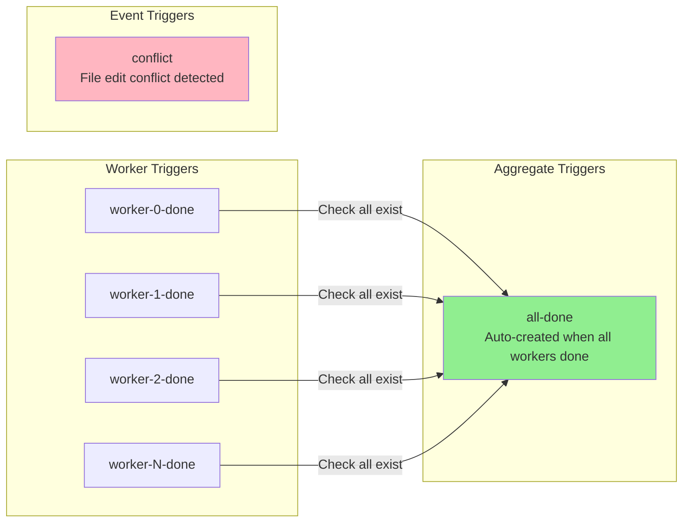

---

## Protocol Workflows

### Default Protocol Workflow

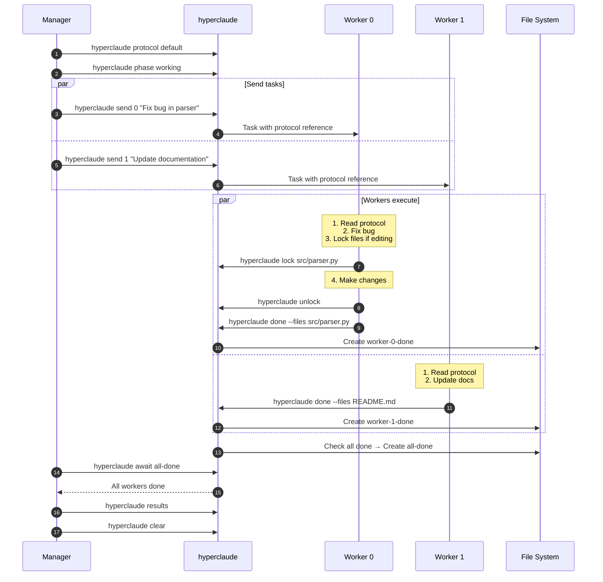

### Git-Branch Protocol Workflow

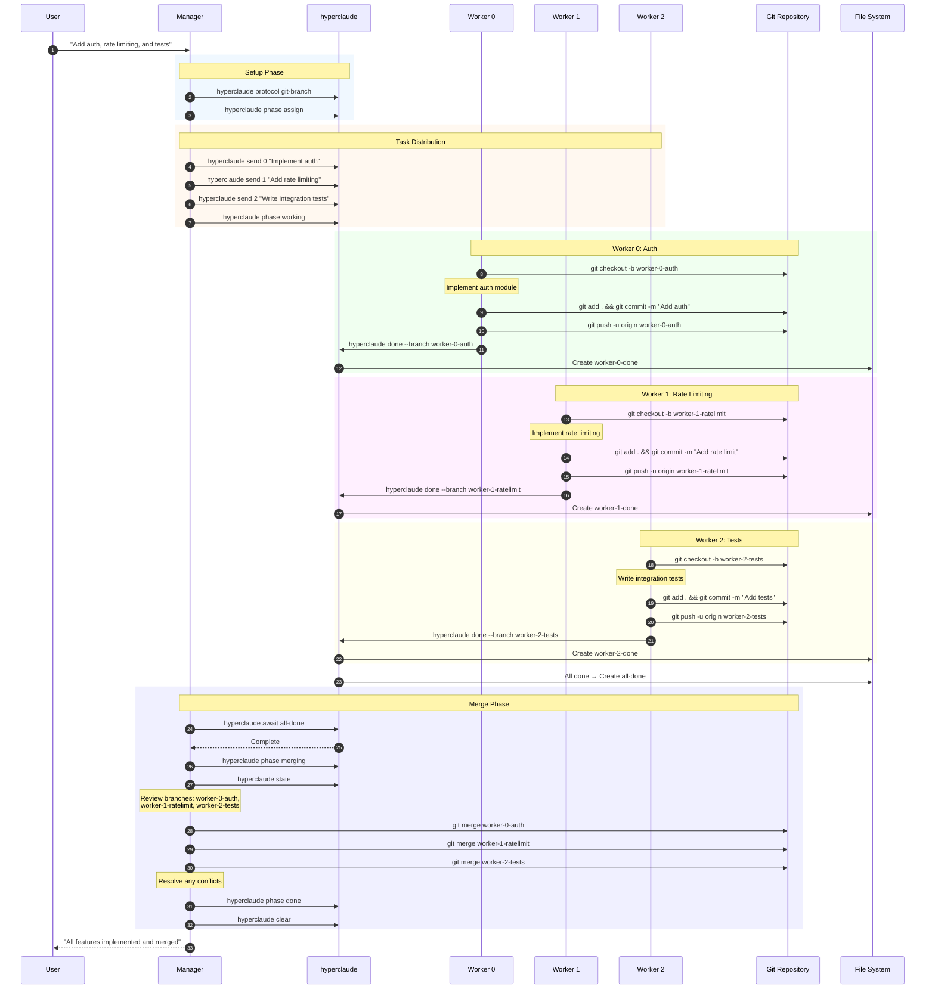

### Search Protocol Workflow

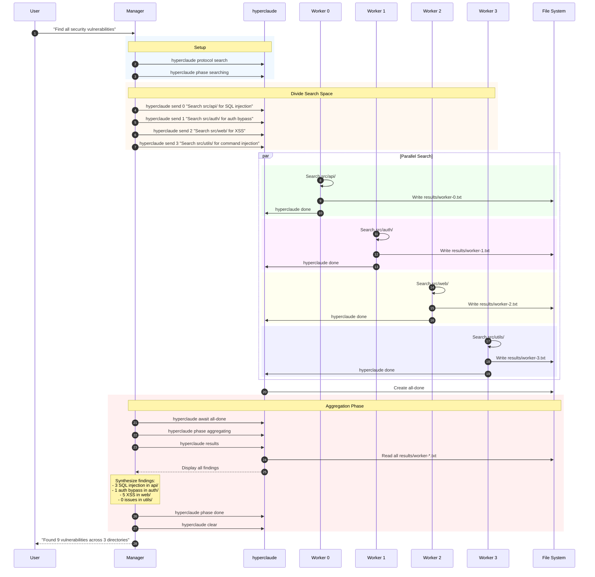

### Review Protocol Workflow

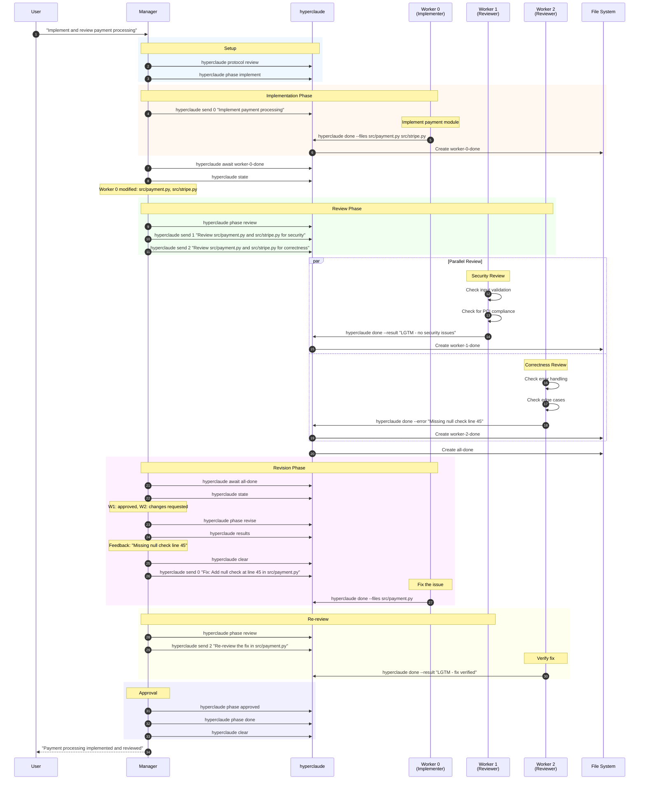

---

## Token Efficiency

### Before vs After Comparison

```mermaid
graph TB
    subgraph "BEFORE: Verbose Preamble (~150 tokens per task)"
        B1["You are Worker 0 in a HyperClaude swarm."]
        B2["CRITICAL PROTOCOL - Follow these steps:"]
        B3["1. Execute the task below autonomously"]
        B4["2. When complete, run: hyperclaude report --worker 0 'summary'"]
        B5["3. Before editing files, run: hyperclaude lock file1.py"]
        B6["4. After editing, run: hyperclaude unlock --worker 0"]
        B7["5. If another worker has locked a file, report conflict"]
        B8["TASK: Search for TODO comments"]

        B1 --> B2 --> B3 --> B4 --> B5 --> B6 --> B7 --> B8
    end

    subgraph "AFTER: Minimal Preamble (~30 tokens per task)"
        A1["W0 | git-branch | working"]
        A2["Task: Search for TODO comments"]
        A3["Protocol: ~/.hyperclaude/protocols/git-branch.md"]

        A1 --> A2 --> A3
    end

    style B1 fill:#FFB6C1
    style B2 fill:#FFB6C1
    style B3 fill:#FFB6C1
    style B4 fill:#FFB6C1
    style B5 fill:#FFB6C1
    style B6 fill:#FFB6C1
    style B7 fill:#FFB6C1
    style B8 fill:#FFB6C1

    style A1 fill:#90EE90
    style A2 fill:#90EE90
    style A3 fill:#90EE90
```

### Token Flow Comparison

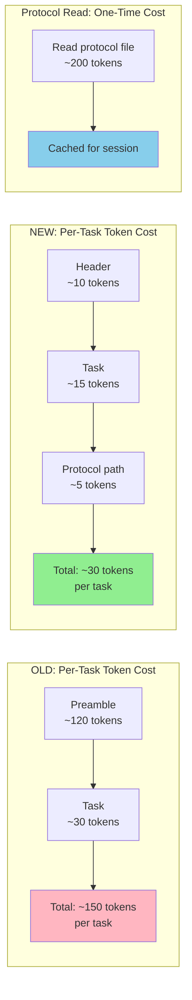

### Savings Calculation

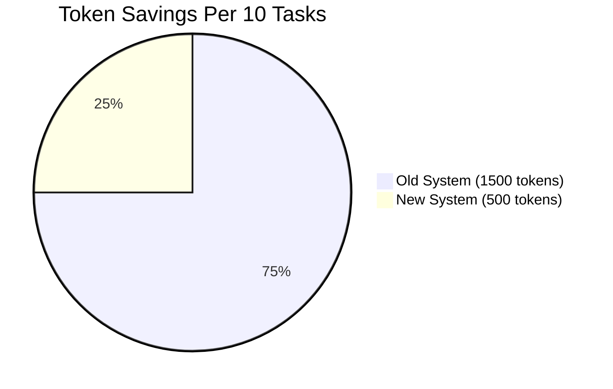

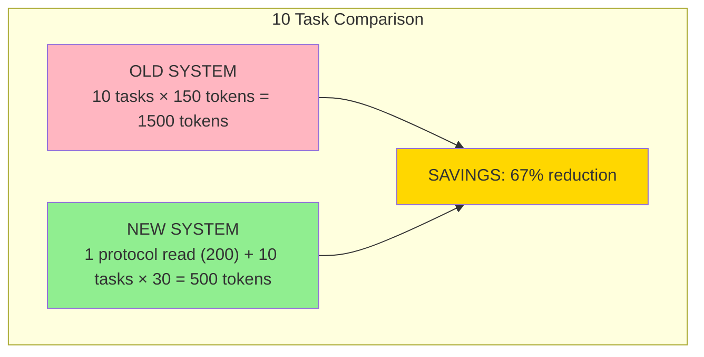

---

## Data Flow

### Complete Data Flow Diagram

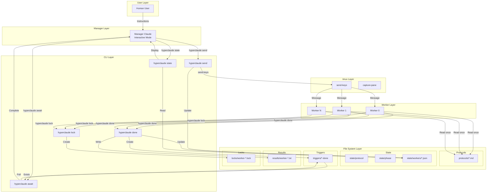

---

## Security Model

```mermaid
graph TB
    subgraph "Permission Levels"
        subgraph "Manager (Interactive)"
            M[Manager Claude]
            M_PERM[Normal Claude permissions<br/>User approval for sensitive ops]
        end

        subgraph "Workers (Autonomous)"
            W[Worker Claudes]
            W_PERM[--dangerously-skip-permissions<br/>Full autonomous execution]
        end
    end

    subgraph "Rationale"
        M_WHY["Manager: User interacts directly<br/>Needs approval for safety"]
        W_WHY["Workers: Execute delegated tasks<br/>Already approved by manager"]
    end

    subgraph "File Lock Safety"
        LOCK_CHECK{Check for conflicts}
        LOCK_OK[Proceed with edit]
        LOCK_FAIL[Report conflict]
    end

    M --> M_PERM
    W --> W_PERM

    M_PERM --> M_WHY
    W_PERM --> W_WHY

    W -->|"hyperclaude lock"| LOCK_CHECK
    LOCK_CHECK -->|"No conflict"| LOCK_OK
    LOCK_CHECK -->|"File locked"| LOCK_FAIL

    style M_PERM fill:#90EE90
    style W_PERM fill:#FFD700
    style LOCK_FAIL fill:#FFB6C1
```

### Environment Variable Security

```mermaid
flowchart TD
    subgraph "Worker Environment Setup"
        START[Pane created]
        EXPORT["export HYPERCLAUDE_WORKER_ID=N"]
        CLAUDE["claude --dangerously-skip-permissions"]
        READY[Worker ready]
    end

    subgraph "Auto-Detection"
        CMD[hyperclaude done / lock / unlock]
        CHECK{HYPERCLAUDE_WORKER_ID<br/>set?}
        USE_ENV[Use environment value]
        ERROR[Error: Worker ID required]
    end

    START --> EXPORT --> CLAUDE --> READY

    CMD --> CHECK
    CHECK -->|Yes| USE_ENV
    CHECK -->|No| ERROR

    style EXPORT fill:#87CEEB
    style USE_ENV fill:#90EE90
    style ERROR fill:#FFB6C1
```

---

## Command Reference Diagram

```mermaid
graph TD
    subgraph "Swarm Lifecycle"
        START[hyperclaude]
        STOP[hyperclaude stop]
    end

    subgraph "Protocol Management"
        PROTO_SET[hyperclaude protocol NAME]
        PROTO_GET[hyperclaude protocol]
        PROTO_LIST[hyperclaude protocols]
        PHASE_SET[hyperclaude phase NAME]
        PHASE_GET[hyperclaude phase]
    end

    subgraph "Task Management"
        SEND[hyperclaude send N TASK]
        BROADCAST[hyperclaude broadcast TASK]
        AWAIT[hyperclaude await TRIGGER]
        STATE[hyperclaude state]
        RESULTS[hyperclaude results]
        CLEAR[hyperclaude clear]
    end

    subgraph "Worker Commands"
        DONE[hyperclaude done]
        LOCK[hyperclaude lock FILES]
        UNLOCK[hyperclaude unlock]
        LOCKS[hyperclaude locks]
    end

    START -->|"Creates swarm"| PROTO_SET
    PROTO_SET -->|"Set protocol"| SEND
    SEND -->|"Workers execute"| DONE
    DONE -->|"Triggers"| AWAIT
    AWAIT -->|"Check"| STATE
    STATE -->|"Review"| RESULTS
    RESULTS -->|"Reset"| CLEAR
    CLEAR -->|"Next batch"| SEND
    STOP -->|"End session"| START

    style START fill:#90EE90
    style STOP fill:#FFB6C1
    style DONE fill:#FFD700
    style AWAIT fill:#87CEEB
```

---

## Summary

hyperclaude achieves efficient swarm coordination through:

1. **Token Efficiency**: Minimal preambles with protocol file references
2. **Event-Driven**: Trigger files instead of polling
3. **State Management**: JSON-based worker state for extensibility
4. **Security**: Manager with normal permissions, workers with bypass
5. **Flexibility**: Four built-in protocols, custom protocols supported
6. **Simplicity**: File-based coordination, no external dependencies

The architecture prioritizes reducing token usage while maintaining clear coordination between manager and workers.
